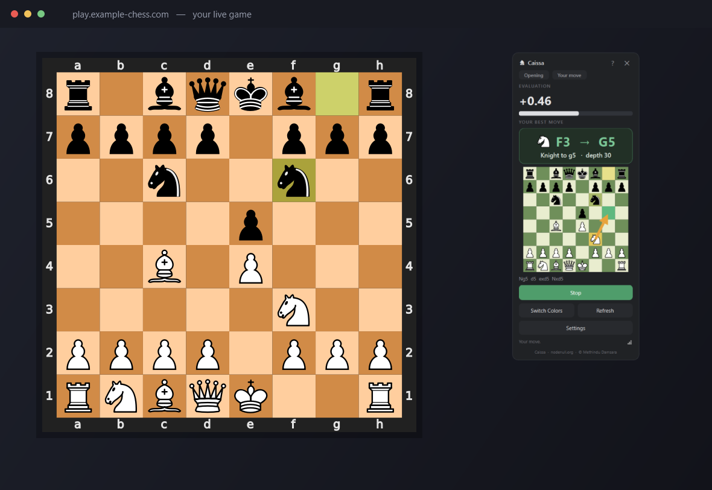
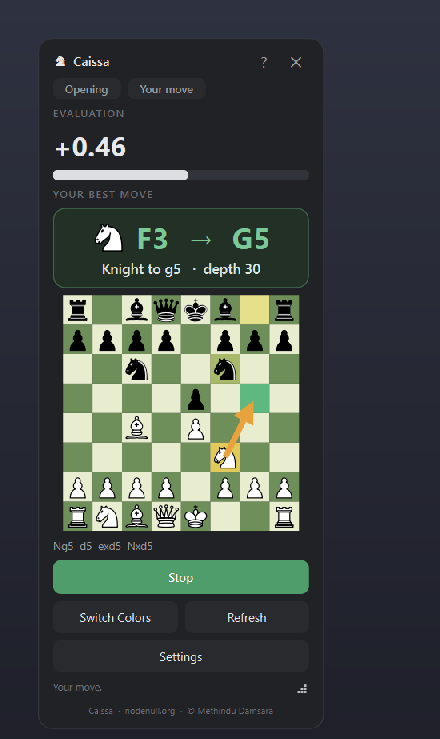
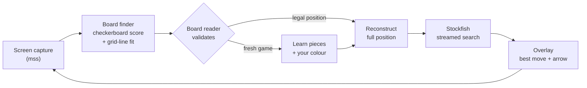

<div align="center">

# ♞ Caissa Chess Overlay

**An always-on-top desktop assistant that finds a chess board anywhere on your
screen, reads the position, and shows you the best move — automatically.**

Named after *Caissa*, the goddess of chess.




</div>

---

> **Fair-play note.** This is an analysis / training tool. Using engine
> assistance during rated or competitive online games violates the terms of
> Chess.com, Lichess, FIDE online events, etc. Use it for study, post-game
> review, streaming overlays, or analysing your own saved games.

## Highlights

- **Zero setup.** One self-contained `Caissa.exe` — Python, the libraries, and
  the Stockfish engine are all bundled inside. No install, no dependencies, no
  admin rights.
- **Finds the board by itself.** Scans the screen, locates the board by its
  checkerboard pattern, snaps to the exact squares, learns the pieces, and
  detects whether you're **White or Black** — all automatically.
- **Reads any flat 2-D board.** Works on essentially any website or app; it
  reconstructs the full position from pixels every scan, so it self-corrects,
  joins games already in progress, and never desyncs.
- **Unmistakable guidance.** The piece to move, the squares (`F3 → G5`), a
  plain-English line, and on the mini-board a **yellow** from-square, **green**
  to-square and an arrow.
- **Fast and strong.** First suggestion in ~100 ms, then a live-streamed deeper
  search up to your chosen time budget. Ignores small example/diagram boards.
- **Portable.** Drop it on a USB stick and run it on any Windows PC, with an
  optional mode that keeps your settings on the stick and leaves nothing behind.

<div align="center">

</div>

## Player or developer?

| You want to... | Get this | You need |
|----------------|----------|----------|
| **Just use the app** | **`Caissa.exe`** from the [**Releases**](../../releases) page | Nothing else — Python, all libraries and the Stockfish engine are inside the exe. Download, double-click, play. |
| **Read, run or modify the code** | This repository (clone or *Code → Download ZIP*) | Python 3.10+, the pip requirements, and a Stockfish binary — see [Run from source](#run-from-source-developers). |

> ⚠️ The green **Code → Download ZIP** button gives you the **source code
> only** — `Caissa.exe` is *not* in the repository (it's ~160 MB). To use the
> app without installing anything, download it from
> [**Releases**](../../releases).

## Quick start (players)

Get `Caissa.exe` from the [**Releases**](../../releases) page. Then just
double-click it and open a chess game anywhere on screen — Caissa finds the
board, sets itself up, and shows your move when it's your turn. Four buttons are
all you need:

| Button | What it does |
|--------|--------------|
| **Start / Stop** | Turn the assistant on or off. |
| **Switch Colors** | Press if it has you as the wrong side (you play from the top of the board). |
| **Refresh** | Re-find and re-read the board if it ever misses a move. |
| **Settings** | Thinking-time & CPU-cores sliders, plus manual fallbacks. |

Drag the grip in the bottom-right corner to resize; a bigger window means a
bigger, clearer board.

## System requirements

**To run `Caissa.exe`:** 64-bit **Windows 10 or 11**, and a CPU with **AVX2**
(Intel from ~2013, AMD from ~2015 — effectively any modern machine). Nothing
else — no Python, no Stockfish install. First launch takes a few seconds while
the bundled engine unpacks to a temp folder, and an unsigned exe may trigger a
one-time SmartScreen prompt (*More info → Run anyway*).

**No AVX2?** Caissa checks at startup and tells you plainly instead of silently
showing no moves. On such a machine, download a non-AVX2 Stockfish (the
`x86-64` or `x86-64-sse41-popcnt` build) from
[stockfishchess.org](https://stockfishchess.org/download/) and point
**Settings → Custom engine** at it.

## Run from source (developers)

Everything below this point is for working on the code — none of it is needed
to just use the app. Requires **Python 3.10+**.

```bash
git clone <your-repo-url>
cd "Caissa Chess Overlay"
python -m pip install -r requirements.txt
python run.py
```

### Getting the Stockfish engine

The engine binary is **not committed to the repo** (it's large and GPL-licensed),
so for a source checkout you need to provide it once:

1. Download Stockfish for Windows from **<https://stockfishchess.org/download/>**
   (the `x86-64-avx2` build is recommended for modern CPUs).
2. Unzip it and place the executable at **`engine/stockfish.exe`**.

Caissa looks for the engine at `engine/stockfish.exe`, then next to the app,
then on your system `PATH`. (When you build `Caissa.exe`, this binary is bundled
inside it — end users never need to do this.)

Diagnostic: `python run.py --engine-selftest` writes engine + data-dir info to
`%TEMP%\caissa_selftest.json`.

## Build the executable

```bash
python -m pip install -r requirements.txt -r dev-requirements.txt
python build.py
```

Produces a single self-contained **`Caissa.exe`** at the project root (the engine
and icon are bundled inside; build scratch is auto-cleaned).

## Tests

The vision pipeline (board finding + full-position reading) and core logic have
a self-contained test suite that needs **no chess engine and no display**, so it
runs anywhere — including CI:

```bash
python -m pip install numpy opencv-python chess pytest
python -m pytest tests/ -q
```

A GitHub Actions workflow ([`.github/workflows/ci.yml`](.github/workflows/ci.yml))
byte-compiles the source and runs these tests on every push (Python 3.10 & 3.12).

## How it works



**Find → propose → validate.** The finder scores every candidate board rectangle
(multi-scale checkerboard statistics via integral images), snaps the best ones
to the exact squares by fitting a comb of grid lines (piece-robust, sub-pixel),
and only *proposes* them. A candidate is accepted **only if the board reader
validates it** — either it's a fresh starting position (pieces and your colour
are learned on the spot) or, with templates already known, it reads as a *legal*
position with high confidence. Wrong candidates simply fail validation, so false
locks are impossible — including the app's own on-screen mini-board, whose
window rectangle is explicitly excluded.

**Reading, not tracking.** The full position is reconstructed from pixels on
every scan (template-match each square → reassemble the board → resolve
side-to-move by legality), so it self-corrects and can join games in progress.

**Responsive at full strength.** The engine search is *streamed*: the first move
appears in ~100 ms and refines live up to the think-time cap. It is aborted the
instant the on-screen position changes, so thinking never blocks detection; on
the opponent's turn it ponders to warm the engine's hash. A cheap frame-diff
gate skips the expensive read while nothing on the board moves.

### Project layout

```
Caissa Chess Overlay/
├── Caissa.exe              the application (not in the repo - download from
│                           Releases or produce it with build.py)
├── run.py                  run from source
├── build.py                rebuild Caissa.exe
├── requirements.txt
├── src/caissa/             the Python package
│   ├── app.py              entry point
│   ├── config.py           settings + user-data location
│   ├── engine.py           streamed, time-capped engine wrapper
│   ├── engine_locator.py   finds the engine (absolute path)
│   ├── capture.py          screen capture (mss)
│   ├── board_finder.py     locates the board on screen
│   ├── board_reader.py     reads the full position from pixels
│   ├── board_state.py      phase + plain-English move descriptions
│   ├── analysis_worker.py  SEARCH → LOCK → TRACK state machine (QThread)
│   └── ui/                 overlay window, mini-board, region selector
├── resources/              app icon (+ its procedural generator)
├── engine/                 the Stockfish binary (see above)
├── tests/                  engine-free test suite (pytest)
├── .github/workflows/      continuous integration
└── docs/                   screenshots
```

## Settings

- **Thinking time** — how long the engine may keep improving the move (the first
  suggestion is always instant; this caps the deep polish).
- **CPU cores** — how much of the machine the engine may use. The default is
  half your cores, which stays polite to the game you're playing in; slide up
  for a faster/deeper search or down to be gentler on the system.
- **Move detection** sensitivity, plus manual **Set board box / Calibrate /
  Debug shot** fallbacks for unusual themes.

## Data & portable mode

By default, settings and the learned board are stored in **`%LOCALAPPDATA%\Caissa`**
— *not* in the app folder — so the install directory stays clean.

Put a **`portable.txt`** file next to `Caissa.exe` (included in this repo) to
switch to **portable mode**: everything is then kept in a `Caissa-data` folder
right beside the app, so it travels on a USB stick and leaves nothing on the
host machine. Delete the file to revert.

## Limitations

- **Flat 2-D boards only** — 3-D / perspective board views aren't supported.
- Whose-move-it-is can be ambiguous on a cold mid-game join — press **Switch
  Colors** if it guessed wrong (it self-corrects once a move is played).
- Auto-detection is tuned for common board themes; on an unusual one, use the
  manual fallbacks in **Settings → Troubleshooting**.

## Credits & licence

Developed by **Methindu Damsara** ([nodenull.org](https://nodenull.org)).

Built-in engine: **[Stockfish 17.1](https://stockfishchess.org)** (GPLv3,
bundled unmodified). Board logic & SVG rendering:
**[python-chess](https://github.com/niklasf/python-chess)** (GPLv3). UI:
**PyQt6** (GPLv3 edition); vision: **OpenCV**, **NumPy**, **mss**. Full
attributions, exact versions and licence texts for every component are in
[`THIRD_PARTY.txt`](THIRD_PARTY.txt).

Because it bundles and links against GPLv3 components, **Caissa Chess
Overlay is distributed under the GNU General Public License v3** — see
[`LICENSE`](LICENSE) for the complete text.
